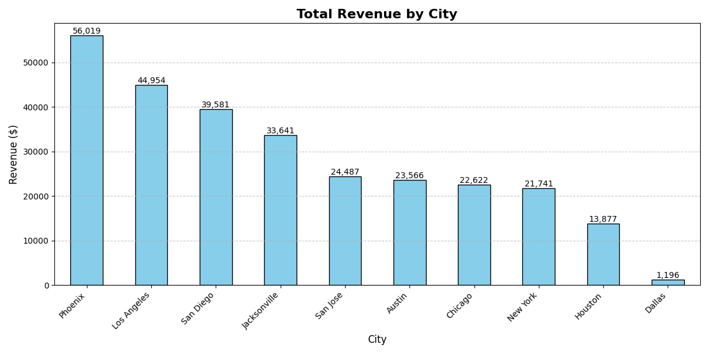
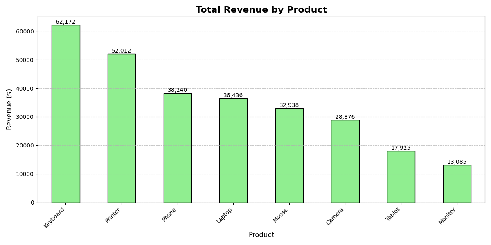
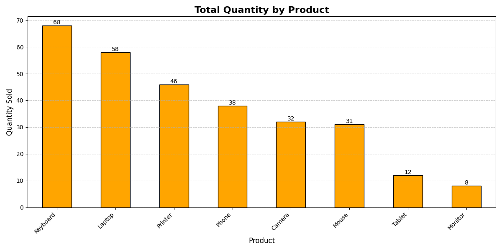
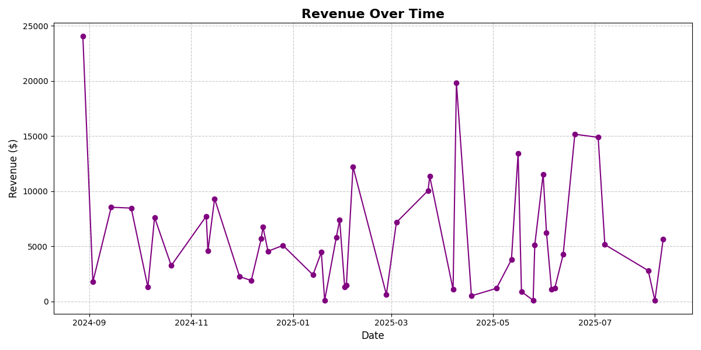

# Elevate Lab Python Internship — Task 5 -> Data Analysis on CSV file.

## 📋 Task Overview
**This project performs sales data analysis using Python’s pandas and matplotlib libraries.
It calculates total revenue and quantity sold by city and product, as well as revenue trends over time.
The analysis results are shown through clear, client-friendly charts that are both displayed and saved as PNG files for reporting**.

---
**Objective**:
  - Analyze sales data using pandas

---

**Key Concepts**:
  - Pandas
  - Dataframe
  - Visualization
    
---

## 📚 Approach

1. Load the data from CSV using pandas.

2. Prepare the data:

    - Convert purchase dates to datetime format.

    - Calculate Revenue = Quantity × Price.

3. Analyze the data:

    - Total revenue by city.

    - Total revenue by product.

    - Total quantity sold by product.

    - Revenue trend over time.

4. Visualize the results:

    - Create colorful, easy-to-read bar charts with values shown on top.

    - Create a line chart for revenue over time.

5. Save and display all charts for client use

---

## 📊 Data Analysis Results

Below are the charts generated as part of the **Sales Data Analysis Task**.  
These images are **automatically generated by the analysis script**.

### 1. Revenue by City

### 2. Revenue by Product

### 3. Quantity Sold by Product

### 4. Revenue Over Time

---

##  🛠 Tools Used

- **Python** – Main programming language.
- **pandas** – For data loading, cleaning, and analysis.
- **matplotlib** – For generating visualizations.
- **CSV** – Data source format.
- **NumPy** – (via pandas) for numeric operations.

---
